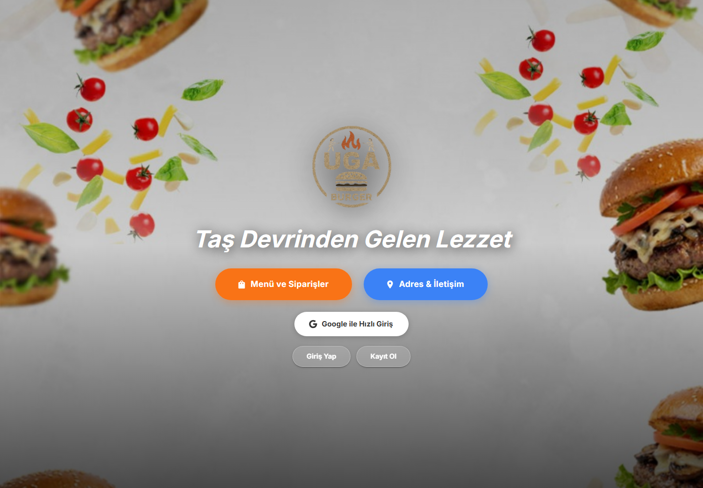
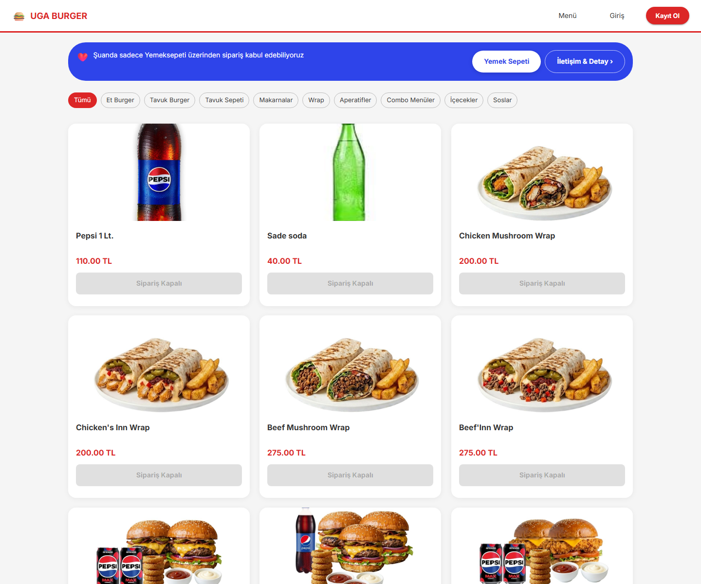
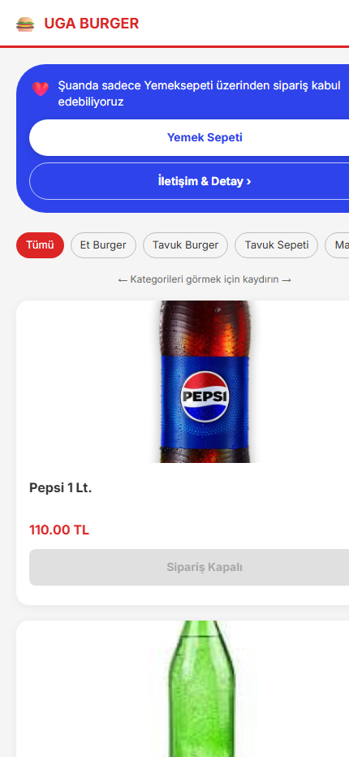
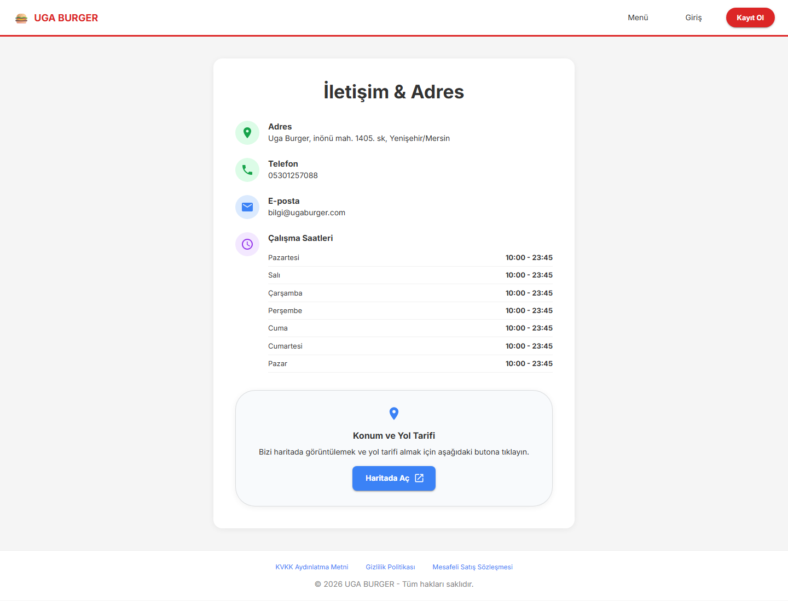
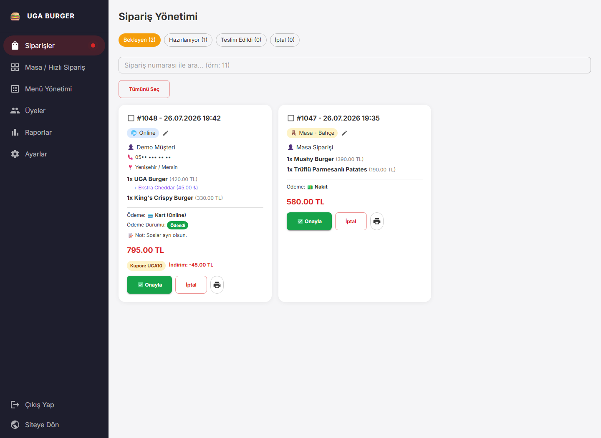
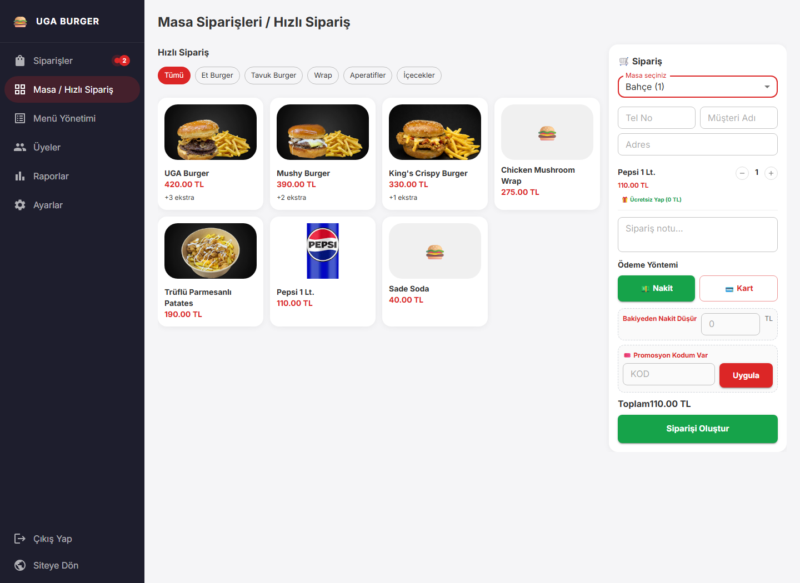
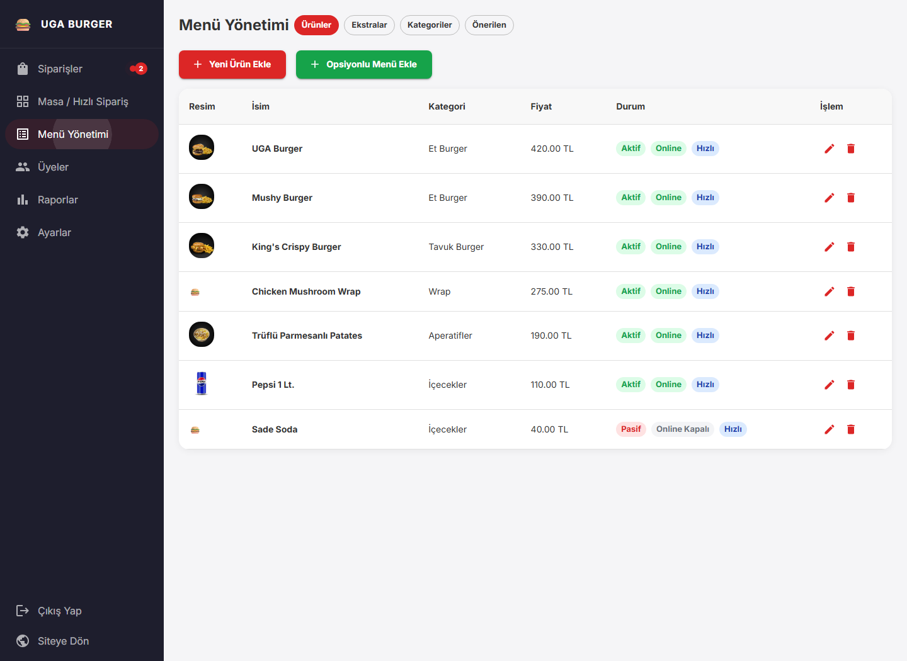
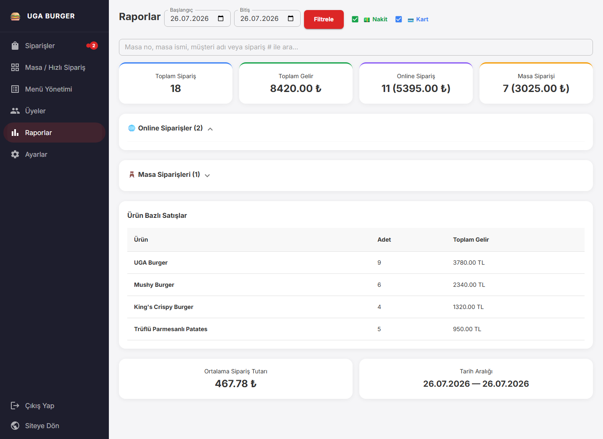
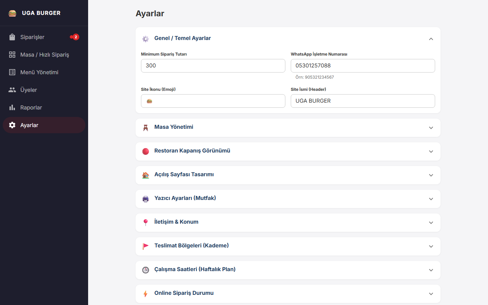
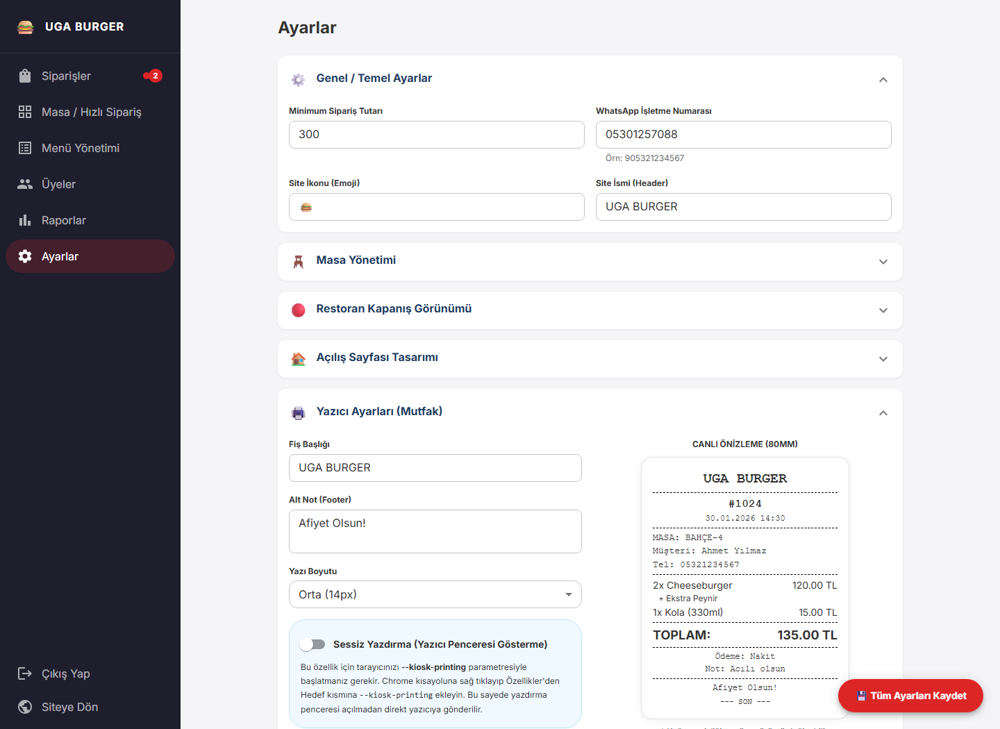

<div align="center">
  

  # UGA Burger

  **Online siparişten masa operasyonuna, ödemeden raporlamaya kadar restoranın dijital iş akışını tek merkezde buluşturan uçtan uca platform.**

  <p>
    <a href="https://ugaburger.com">
      
    </a>
    <a href="https://ugaburger.com/menu">
      
    </a>
    
    
    
  </p>

  [Ürün](#ürün) · [Ekranlar](#müşteri-deneyimi) · [Yönetim Paneli](#yönetim-paneli) · [Mimari](#sistem-mimarisi) · [Teknik Yapı](#teknik-yapı)
</div>

<br />



## Ürün

UGA Burger, müşterinin menüyü keşfetmesinden siparişini tamamlamasına; restoran ekibinin siparişi karşılamasından satışları raporlamasına kadar tüm süreci kapsayan gerçek kullanım odaklı bir restoran otomasyonudur.

Platform yalnızca bir online menü değildir. Dinamik ürün seçenekleri, teslimat bölgeleri, masa siparişleri, promosyonlar, online ödeme, e-Fatura/e-Arşiv, termal fiş çıktısı ve merkezi yönetim paneli aynı sipariş modeli etrafında birlikte çalışır.

| Müşteri deneyimi | Restoran operasyonu | İşletme yönetimi |
|---|---|---|
| Mobil menü, ürün seçenekleri, sepet, adres ve sipariş takibi | Canlı sipariş ekranı, masa/POS akışı, ödeme ve fiş işlemleri | Menü, üyeler, kampanyalar, raporlar ve mağaza ayarları |

## Müşteri deneyimi

### Dinamik menü ve sipariş akışı

Kategoriler, ürünler, seçenek grupları, ekstralar ve ürün görselleri yönetim panelinden düzenlenir. Kategori şeridi ve ürün kartları, geniş menülerde hızlı gezinme sağlayacak şekilde tasarlanmıştır.



### Mobil kullanım ve mağaza bilgileri

Menü, kategori navigasyonu ve sipariş adımları mobil öncelikli davranır. Adres, telefon, e-posta, çalışma saatleri ve harita yönlendirmesi ise merkezi mağaza ayarlarından beslenir.

<table>
  <tr>
    <td width="34%" align="center">
      
      <br />
      <sub>Mobil ürün kataloğu</sub>
    </td>
    <td width="66%" align="center">
      
      <br />
      <sub>İletişim, çalışma saatleri ve yol tarifi</sub>
    </td>
  </tr>
</table>

## Yönetim paneli

Yönetim paneli; günlük operasyonu, ürün kataloğunu ve işletme ayarlarını tek arayüz altında toplar. Aşağıdaki yönetim ekranları projenin gerçek React bileşenleriyle ve temsili demo verileriyle görüntülenmiştir.

### Sipariş merkezi

Bekleyen, hazırlanan, teslim edilen ve iptal edilen siparişler durum bazlı izlenir. Online ve masa siparişleri aynı merkezde; ödeme, promosyon, müşteri notu ve fiş bilgileriyle birlikte yönetilir.



### Masa operasyonu ve menü yönetimi

<table>
  <tr>
    <td width="50%" align="center">
      
      <br />
      <sub>Masa seçimi, hızlı ürün girişi, bölünmüş ödeme ve promosyon</sub>
    </td>
    <td width="50%" align="center">
      
      <br />
      <sub>Ürün, kategori, seçenek ve satış kanalı yönetimi</sub>
    </td>
  </tr>
</table>

### Raporlama

Online ve masa siparişleri; tarih, ödeme yöntemi, ürün adedi ve gelir üzerinden analiz edilir. Yönetim ekranı günlük toplamları ve ürün performansını birlikte gösterir.



### Merkezi ayarlar ve termal yazıcı

<table>
  <tr>
    <td width="50%" align="center">
      
      <br />
      <sub>Mağaza, tasarım, teslimat, çalışma saatleri ve kampanya ayarları</sub>
    </td>
    <td width="50%" align="center">
      
      <br />
      <sub>80 mm fiş düzeni, canlı önizleme ve sessiz yazdırma</sub>
    </td>
  </tr>
</table>

## Öne çıkan yetenekler

| Alan | Yetenekler |
|---|---|
| Menü | Kategori, ürün, ekstra, seçenek grubu, önerilen ürün ve kanal görünürlüğü |
| Sipariş | Online, telefon ve masa siparişi; durum takibi; müşteri notları |
| Teslimat | Kayıtlı adresler, konum doğrulama, kademeli teslimat bölgeleri ve minimum sepet |
| Ödeme | Nakit, kart, online ödeme ve bölünmüş ödeme akışı |
| Kampanya | Yüzdesel veya sabit indirim, minimum tutar ve kullanım limiti |
| Operasyon | Sesli/görsel bildirim, toplu durum güncelleme ve masa atama |
| Faturalama | Bireysel/kurumsal bilgiler, e-Fatura ve e-Arşiv akışı |
| Raporlama | Tarih, kanal, ödeme yöntemi, ürün adedi, ciro ve ortalama sepet |
| Yazdırma | Özelleştirilebilir 80 mm fiş ve Electron üzerinden sessiz çıktı |
| İçerik | Marka, ana sayfa, mağaza durumu, iletişim ve çalışma saatleri |

## Sistem mimarisi

```text
Müşteri web arayüzü                  Restoran yönetim paneli
        │                                      │
        ├── Menü ve ürün seçenekleri           ├── Sipariş merkezi
        ├── Sepet ve adres                     ├── Masa / hızlı sipariş
        └── Sipariş / online ödeme             └── Menü, rapor ve ayarlar
                        │               │
                        └───────┬───────┘
                                ▼
                         Express REST API
                                │
             ┌──────────────────┼──────────────────┐
             ▼                  ▼                  ▼
      MySQL / PostgreSQL     PayTR ödeme     E-Fatura / E-Arşiv
             │
             └──────────────► Electron POS ───────► Termal yazıcı
```

Müşterinin gördüğü içerik, mağaza durumu ve operasyon kuralları yönetim panelindeki ayarlardan beslenir. Sipariş oluşturulduğunda ödeme, ürün, adres, promosyon ve fatura verileri aynı kayıt etrafında birleşir; operasyon ekibi süreci tek panelden ilerletir.

## Teknik yapı

| Katman | Teknolojiler |
|---|---|
| Arayüz | React 19, Vite 8, Material UI 9, React Router 7 |
| İstemci veri akışı | Context API, Axios, React Hot Toast |
| Harita | Leaflet, React Leaflet |
| Sunucu | Node.js, Express 4 |
| Veri katmanı | Sequelize 6, MySQL / MariaDB, PostgreSQL |
| Medya | Multer, Sharp |
| Masaüstü POS | Electron |
| Servisler | PayTR, Google OAuth, Aktif Dönüşüm, Nodemailer |

### Mühendislik tercihleri

- Rota bazlı lazy loading ile büyük ekranlar ihtiyaç anında yüklenir.
- Vite chunk ayrımı; React, MUI, harita ve istemci paketlerini ayrı önbellek parçalarına böler.
- Görsel yükleme hattı medya dosyalarını optimize eder.
- API yanıtlarında sıkıştırma, statik içeriklerde uzun süreli tarayıcı önbelleği kullanılır.
- Ayar tabanlı yapı sayesinde mağaza metinleri, görseller ve operasyon kuralları kod değişikliği olmadan yönetilir.
- Veri katmanı MySQL/MariaDB ve PostgreSQL ile çalışabilecek şekilde soyutlanmıştır.
- Web yönetim paneli ve Electron POS aynı API ve sipariş iş akışını paylaşır.
- Responsive bileşenler masaüstü, tablet ve mobil ekranlara ayrı düzenlerle uyum sağlar.

## Proje haritası

```text
MusattiBurger/
├── client/
│   ├── public/                 # Marka varlıkları ve bildirim sesi
│   └── src/
│       ├── api/                # API istemcisi
│       ├── components/
│       │   ├── Admin/          # Operasyon ve yönetim paneli
│       │   ├── Auth/           # Üyelik ekranları
│       │   ├── Cart/           # Sepet, adres ve sipariş akışı
│       │   ├── Contact/        # Mağaza ve iletişim görünümü
│       │   ├── Home/           # Ana vitrin
│       │   ├── Layout/         # Navigasyon ve sayfa iskeleti
│       │   ├── Menu/           # Katalog ve ürün seçenekleri
│       │   └── Profile/        # Profil ve sipariş geçmişi
│       ├── context/            # Oturum ve sepet durumu
│       └── App.jsx             # Rotalar ve uygulama kompozisyonu
├── server/
│   ├── controllers/            # İş kuralları
│   ├── models/                 # Sequelize veri modeli
│   ├── routes/                 # REST uçları
│   ├── services/               # Fatura ve dış servis akışları
│   └── server.js               # Express uygulaması
├── electron/                   # POS ve sessiz yazdırma köprüsü
├── Images/                     # Ürün görselleri
└── docs/screenshots/           # Ürün ve yönetim paneli görselleri
```

## Yönetim modülleri

| Modül | Sorumluluk |
|---|---|
| Siparişler | Sipariş takibi, durum güncelleme, ödeme, masa atama ve fiş |
| Masa / Hızlı Sipariş | Salon siparişi, masa seçimi ve hızlı ürün girişi |
| Menü Yönetimi | Ürün, kategori, ekstra, seçenek ve kanal görünürlüğü |
| Üyeler | Müşteri profili ve kayıtlı adres görünümü |
| Raporlar | Sipariş, ciro, kanal, ödeme ve ürün performansı |
| Ayarlar | Marka, çalışma saatleri, teslimat, iletişim ve operasyon tercihleri |

---

<div align="center">
  <sub>React ve Node.js ile geliştirilen, üretimde kullanılan restoran sipariş ve operasyon platformu.</sub>
</div>
